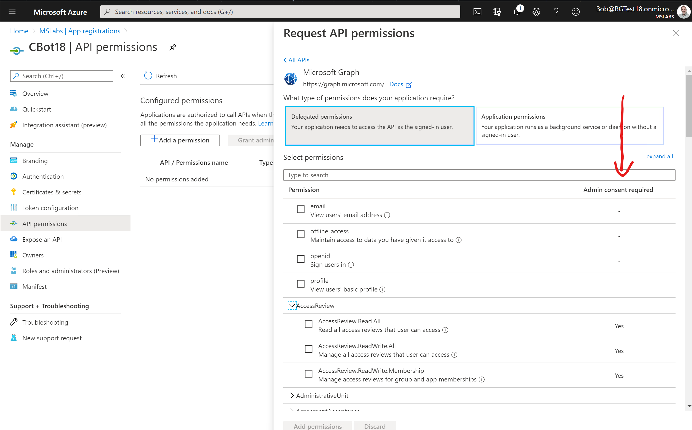
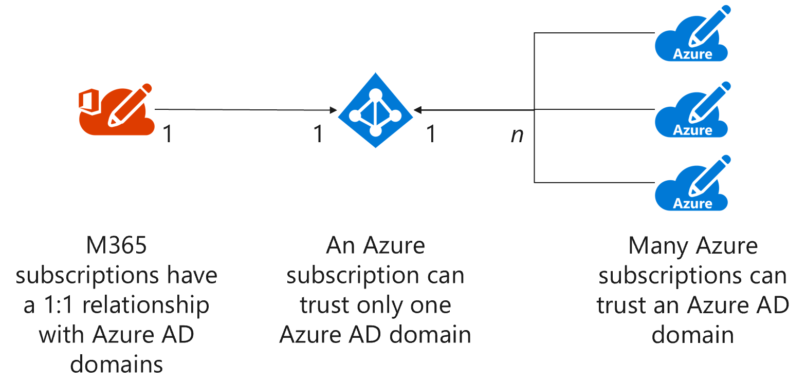

# Calling the Microsoft Graph from your Teams application - Part 1: Introduction and Concepts

Microsoft Teams applications almost always need to call the Graph API, yet it's not as easy as just calling a REST service. Most of the complexity has to do with getting an access token, which is required on every Graph call to establish what, if anything, the caller is authorized to do. 

Getting the access token requires an understanding of Teams, Azure AD, Graph, and sometimes other components like the SharePoint Framework or Bot Framework, yet each of these is documented separately and each one assumes the reader knows all the others. I literally get questions every day from frustrated developers trying to figure this out! (Yesterday I got 3!)

I'm working closely with my colleague [Ayca Bas](https://dev.to/aycabs) to help by publishing articles and code samples that explain, all in one place, how to call Graph from a Teams app. Here's what we have so far:

1. Introduction and concepts (this article)
2. [Calling Graph from a Teams tab using Azure AD SSO](#)
3. [Calling Graph from a Teams tab using Graph Toolkit](https://dev.to/aycabs/handling-authentication-in-custom-teams-tabs-using-microsoft-graph-toolkit-53i8)
4. [Calling Graph from a Teams Tab using SharePoint Framework](#)

More sections that are on the backlog, in rough priority order (comments please!):

5. Calling Graph from a Teams Tab using a browser pop-up
6. Calling Graph from a Teams Bot using the Bot Framework Auth Dialog
7. Calling Graph with elevated permission from a Teams Bot using Client Credentials Flow
8. Calling Graph from a Teams messaging extension
9. Using Azure Functions to call Graph with elevated permission from a Teams tab

Ayca and I are new to Developer Advocacy and haven't learned all the ropes of publishing something official, so consider these articles a draft of some future documentation. Please send feedback so we can get it right!

## What is the Microsoft Graph and why do you need it?

[Microsoft Graph](https://docs.microsoft.com/en-us/graph/overview) is the primary API for Microsoft 365 and for Microsoft Teams. It provides a single REST endpoint (https://graph.microsoft.com/) that can access data and insights across Microsoft 365 services. This includes Microsoft Teams and other services used by Teams such as SharePoint Online, Exchange Online, Excel, Planner, etc. 

You can check out the Graph in action using the [Microsoft Graph Explorer](https://developer.microsoft.com/en-us/graph/graph-explorer). Full reference documentation is [here](https://docs.microsoft.com/en-us/graph/api/overview?toc=./ref/toc.json&view=graph-rest-1.0) (you may want to check the [Beta version](https://docs.microsoft.com/en-us/graph/api/overview?toc=.%2Fref%2Ftoc.json&view=graph-rest-beta) as well.)

Many or most Microsoft Teams applications need to call the Graph to access user profiles, files, calendars, or even for simple things like querying the Team's channels or posting a message. Teams has a [Javascript client SDK](https://docs.microsoft.com/en-us/javascript/api/overview/msteams-client?view=msteams-client-js-latest) that is usable from tabs and task modules, but it's limited to a few helper functions. For most things you need the Graph!

In order to call the Graph, you need an access token from Azure Active Directory which establishes what, if anything, you're authorized to do. The method for obtaining that token varies depending on the type of application feature(s) you're building; for example a tab implemented as a Single Page Application will get an access token differently than a Bot. That's the reason for this article series! But before digging into the detailed scenarios, here are some more concepts that will help you understand what's going on.

## What is Azure Active Directory?

Azure Active Directory (Azure AD) is the identity service used by Microsoft 365 and a number of other Microsoft products. When you log into Microsoft Teams, Microsoft Outlook, SharePoint Online, or other Microsoft 365 services, you are logging into Azure AD. 

Be sure not to confuse Azure AD with other, similarly named services! **Azure AD is NOT the same as:**

 * [Azure Access Control Service](https://docs.microsoft.com/en-us/previous-versions/azure/azure-services/hh147631(v=azure.100)) (Azure ACS): This service predates Azure AD and is still used by [SharePoint Add-ins](https://developer.microsoft.com/en-us/office/blogs/impact-of-azure-access-control-deprecation-for-sharepoint-add-ins/), but has otherwise been [retired](https://azure.microsoft.com/en-us/blog/one-month-retirement-notice-access-control-service/). 
 * [Azure AD B2C](https://azure.microsoft.com/en-us/services/active-directory/external-identities/b2c/): Despite the similar name, this is a completely different identity service used to federate with consumer identity services such as Google and Facebook. It doesn't work with Microsoft 365 identities and can't be used to obtain an access token for calling the Graph.
 * Older versions of Azure AD came in two flavors, v1 and v2. In May, 2019 these were consolidated, however there are still two endpoints (more on this below).

 When you're looking for documentation or samples, make sure you're looking at an up-to-date Azure AD scenario and not one of the other, similarly named services.

## App Registration and Consent

Consider a traditional PC application (in the broadest sense of a personal computer, including Windows, Mac, or Linux). When a user runs such an application, it has the full rights and permissions of that user. This presents a  risk, because the user can't realistically validate what the application is doing; for example, such an application could read files off the local computer and upload them somewhere without the user's knowledge.

More modern applications, such Windows store apps and phone apps, require that an application be registered with the system and the user gets to consent to what the application is allowed to do. For example, if the application wants to read the user's files, the user is asked to consent before the system will allow any file access.

Azure AD works that way too. To access a resource - say a user's calendar - an application must be registered in Azure AD, and then Azure AD will prompt the user or administrator for consent. So even though the user can read her own calendar, each application she uses can only read her calendar if she or her admin says it's OK.

This comes up when you want to call the Graph API. The Graph API is itself an Azure AD application. If you want to call it, you need to register your application and request permission for your application to have a certain permission, like reading the calendar.

> The application you're calling - Graph in this case - is sometimes called a _resource_ or _audience_. The permission - Calendar.Read in this case - is sometimes called a _scope_. These are defined in the [OAuth 2.0 specification](https://tools.ietf.org/html/rfc6749), which is the authorization framework used by Azure AD.

You can register an Azure AD application in the Azure portal (the Office 365 Admin Center also includes a subset of the Azure portal for Azure Active Directory). Register your apps under the "App registration" section. This is where you request the initial permissions for your application. (Applications using the v2.0 endpoint can also request additional permissions at runtime, but that's beyond the scope of this article). 

You may notice that there's a column for "Administrative Consent Required". If this field is blank, then users can consent for themselves; if it's marked "yes", then a tenant administrator has to grant consent.

## Azure AD Tenants

Each instance of Azure AD is called a _tenant_ and has a unique tenant ID (GUID) and DNS name (like contoso.onmicrosoft.com). Each Microsoft 365 subscription has exactly one Azure AD tenant.

While only one Microsoft 365 subscription can be associated with an Azure AD tenant, several Azure subscriptions can be, and it's possible to change an Azure subscription to associate with a different Azure AD tenant. This is important because Azure AD will be able to generate access tokens if:

 - The target application is in the same tenant, OR, 
 - The target application is marked as multi-tenant

In the case of the Microsoft Graph, you don't need to worry about this because Grap

## Azure Active Directory Applications and Permissions

https://docs.microsoft.com/en-us/azure/active-directory/azuread-dev/azure-ad-endpoint-comparison

